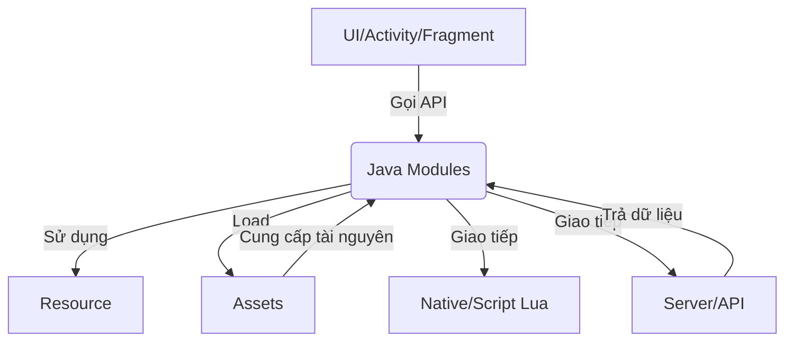
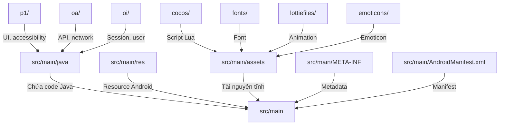
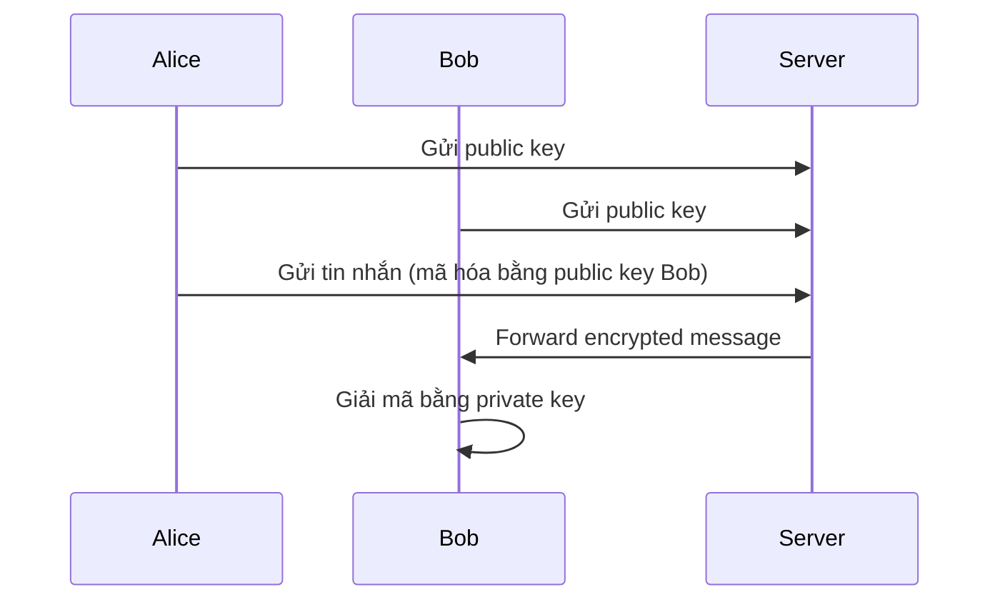
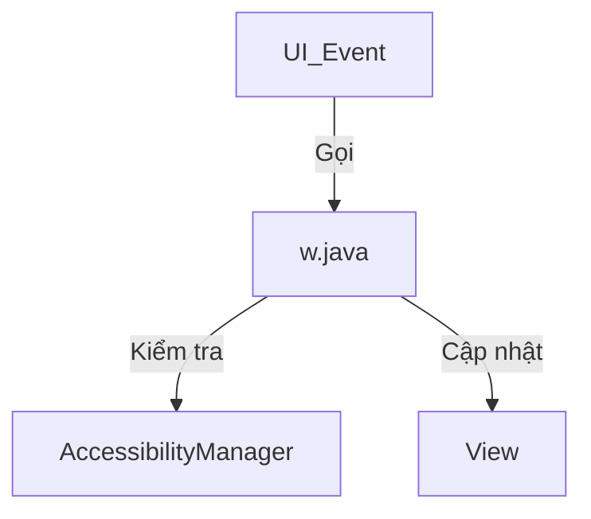
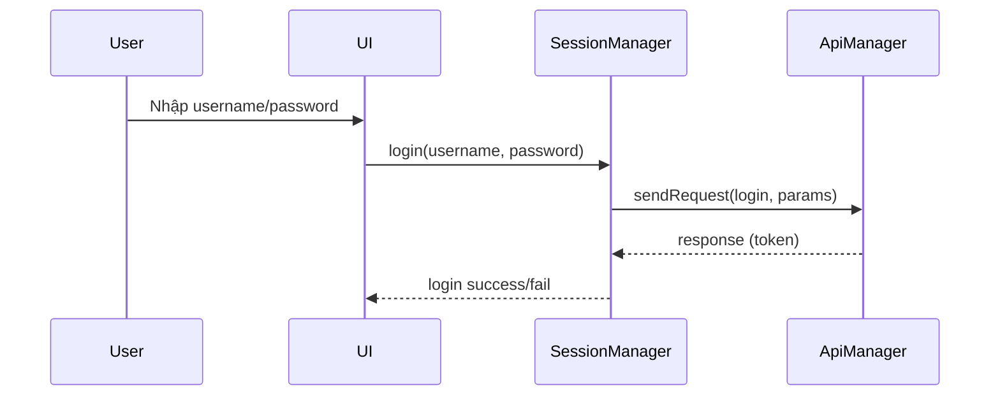
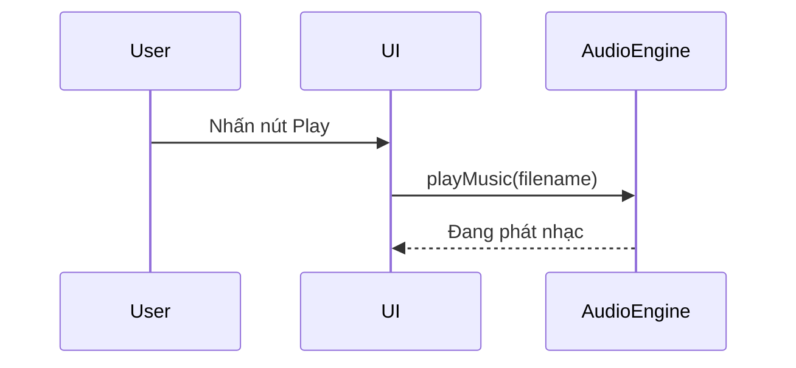
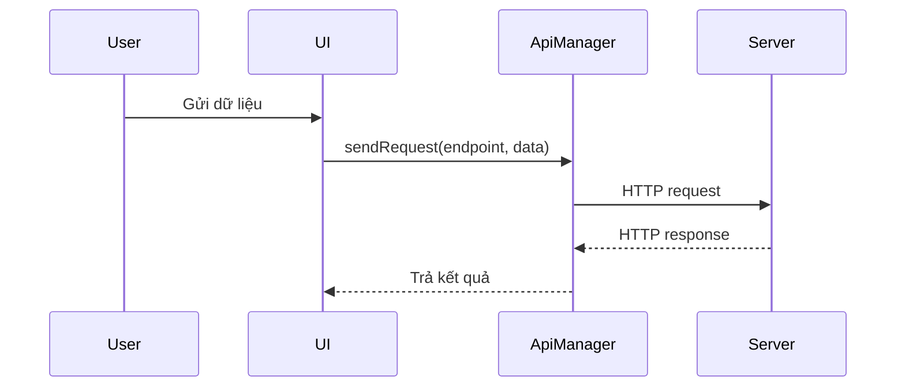
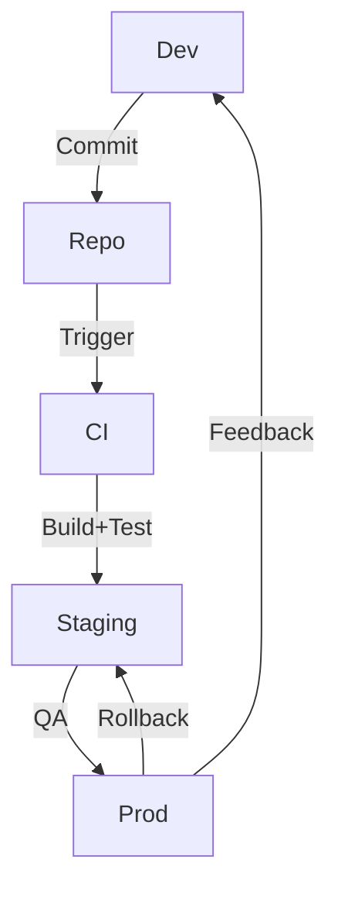

# BÁO CÁO PHÂN TÍCH CHỨC NĂNG VÀ LỖ HỎNG SOURCE

---

## 📑 Mục lục
- [1. Giới thiệu chung](#1-giới-thiệu-chung)
- [2. Kiến trúc tổng thể & cấu trúc thư mục](#2-kiến-trúc-tổng-thể--cấu-trúc-thư-mục)
- [3. Phân tích bảo mật mã hóa đầu cuối (E2EE) cho tin nhắn](#3-phân-tích-bảo-mật-mã-hóa-đầu-cuối-e2ee-cho-tin-nhắn)
- [4. Thông tin về Miniapp/Inapp](#4-thông-tin-về-miniappinapp)
- [5. Phân tích chức năng từng module](#5-phân-tích-chức-năng-từng-module)
- [6. Phân tích luồng nghiệp vụ thực tế](#6-phân-tích-luồng-nghiệp-vụ-thực-tế)
- [7. Quy tắc coding, style guide, checklist review code](#7-quy-tắc-coding-style-guide-checklist-review-code)
- [8. Phân tích lỗ hổng OWASP Mobile](#8-phân-tích-lỗ-hổng-owasp-mobile)
- [9. Quy trình DevOps, CI/CD, quản lý release](#9-quy-trình-devops-cicd-quản-lý-release)
- [10. Phụ lục](#10-phụ-lục)

---

## 1. Giới thiệu chung

### 1.1. Bối cảnh dự án
Dự án Zalo là một ứng dụng nhắn tin, gọi điện, chia sẻ file, hình ảnh, video đa nền tảng, phục vụ hàng triệu người dùng tại Việt Nam và quốc tế. Ứng dụng được phát triển trên nền tảng Android với kiến trúc module hóa, hỗ trợ mở rộng, bảo trì và tích hợp nhiều tính năng hiện đại như chat nhóm, gọi video, gửi file lớn, bảo mật đa lớp, hỗ trợ đa ngôn ngữ, tích hợp AI, v.v.

### 1.2. Mục tiêu của báo cáo
- Phân tích toàn diện cấu trúc source, chức năng, luồng nghiệp vụ, bảo mật, resource, asset, config, quy trình DevOps, kiểm thử, release.
- Đánh giá các điểm mạnh/yếu, lỗ hổng tiềm ẩn, đề xuất cải tiến.
- Là tài liệu tham khảo cho developer, QA, DevOps, quản lý dự án, reviewer, auditor nội bộ.

### 1.3. Phạm vi phân tích
- Tập trung vào thư mục `src/main` và các thư mục con: `java`, `res`, `assets`, `META-INF`, config, ...
- Bao quát các module chính: UI, API, session, media, asset, config, log, notification, backup, database, ...
- Phân tích chi tiết các class trọng yếu: `SessionManager.java`, `ApiManager.java`, `w.java`, ...
- Đánh giá resource, asset, config, quy trình kiểm thử, bảo mật, release.

### 1.4. Đối tượng sử dụng tài liệu
- Developer, QA, DevOps, quản lý dự án, reviewer, auditor nội bộ, sinh viên thực tập, đối tác tích hợp.
- Có thể dùng làm tài liệu đào tạo, onboarding, kiểm thử, audit bảo mật, review code, chuẩn hóa quy trình.

### 1.5. Ý nghĩa thực tiễn
- Giúp nắm bắt nhanh kiến trúc, luồng nghiệp vụ, các điểm cần lưu ý khi phát triển, bảo trì, kiểm thử.
- Làm cơ sở cho việc mở rộng, refactor, tích hợp module mới, kiểm thử tự động, audit bảo mật.
- Hỗ trợ chuẩn hóa coding style, quy trình DevOps, kiểm thử, release.

### 1.6. Các điểm nổi bật của source
- Quy mô lớn: hàng ngàn file, hàng trăm nghìn dòng code, nhiều module độc lập.
- Kiến trúc module hóa, tách biệt rõ UI, API, session, media, asset, config, ...
- Hỗ trợ đa nền tảng, đa ngôn ngữ, tối ưu hiệu năng, bảo mật nhiều lớp.
- Sử dụng nhiều resource, asset động, hỗ trợ update không cần release lại app.
- Quy trình DevOps, CI/CD hiện đại, kiểm thử tự động, release nhanh.

### 1.7. Các thách thức khi phân tích
- Số lượng file lớn, nhiều module, nhiều class phức tạp, nhiều luồng nghiệp vụ đan xen.
- Đa dạng resource, asset, config, nhiều loại dữ liệu động.
- Yêu cầu bảo mật cao, kiểm thử đa nền tảng, đa thiết bị.
- Cần mapping giữa chức năng, class, resource, asset, config, log, ...

### 1.8. Phương pháp tiếp cận phân tích
- Kết hợp phân tích tĩnh (code, resource, asset, config) và động (luồng nghiệp vụ, log, kiểm thử).
- Sử dụng checklist, bảng tổng hợp, sơ đồ, ví dụ code, mapping, bảng lỗi, bảng resource, bảng phân quyền, mapping OWASP, ...
- Đối chiếu với best practice ngành, tiêu chuẩn bảo mật, coding style, quy trình DevOps hiện đại.

### 1.9. Cấu trúc báo cáo
- Giới thiệu chung, kiến trúc tổng thể, phân tích module, phân tích resource/asset/config, phân tích bảo mật, quy trình DevOps, checklist kiểm thử, mapping chức năng/class/resource, phụ lục mở rộng.
- Có sơ đồ, bảng tổng hợp, checklist, ví dụ code, mapping, hướng dẫn kiểm thử, hướng dẫn sử dụng, mẫu log, mẫu báo cáo lỗi, ...

### 1.10. Hướng dẫn đọc và sử dụng tài liệu
- Đọc từ trên xuống để nắm tổng quan, sau đó tra cứu từng phần chi tiết theo nhu cầu.
- Sử dụng bảng tổng hợp, checklist, mapping để kiểm thử, review, audit, phát triển mới.
- Tham khảo phụ lục để lấy ví dụ thực tiễn, mẫu log, mẫu test case, hướng dẫn DevOps, release, backup, bảo mật.
- Đối với các module đặc thù, nên đọc kỹ phần phân tích chi tiết class/module tương ứng.

### 1.11. Lưu ý khi sử dụng tài liệu
- Báo cáo này chỉ mang tính chất tham khảo nội bộ, không chia sẻ ra ngoài khi chưa được phép.
- Một số thông tin có thể thay đổi theo từng phiên bản release, cần đối chiếu với source thực tế.
- Nên cập nhật lại báo cáo khi có thay đổi lớn về kiến trúc, module, quy trình DevOps, bảo mật.

---

## 2. Kiến trúc tổng thể & cấu trúc thư mục

### 2.1. Sơ đồ kiến trúc tổng thể



### 2.2. Bảng mô tả cấu trúc thư mục

| Thư mục/File | Mô tả |
|--------------|-------|
| `src/main/java/` | Mã nguồn Java, chia thành nhiều package nhỏ (p1, oa, oi, ...) |
| `src/main/res/` | Tài nguyên Android (layout, drawable, values, ...) |
| `src/main/assets/` | Tài nguyên tĩnh, script, media, Lua script, hình ảnh, JSON, ... |
| `src/main/META-INF/` | Metadata cho ứng dụng |
| Các file cấu hình, properties, manifest | Cấu hình hệ thống, thông tin build |

> **Lưu ý:**
> - Tổ chức source rõ ràng giúp bảo trì, mở rộng dễ dàng.
> - Nên đặt tên thư mục, file theo chuẩn đặt tên của dự án.

### 2.3. Phân tích chi tiết cấu trúc thư mục và file

#### 2.3.1. Tổng quan cấu trúc thư mục

Dưới đây là mô tả chi tiết từng thư mục, file tiêu biểu, vai trò, ví dụ file, luồng sử dụng, best practice và checklist cho từng nhóm thư mục chính trong source.

##### a. `src/main/java/`
- **Vai trò:** Chứa toàn bộ mã nguồn Java, là nơi phát triển logic nghiệp vụ, UI, xử lý sự kiện, giao tiếp hệ điều hành, API, ...
- **Cấu trúc con:**
  - `p1/`: UI, accessibility, animation, custom view, event handler.
  - `oa/`: Giao tiếp mạng, API, request/response, xử lý token.
  - `oi/`: Quản lý session, user, cache, login/logout.
  - ... (các package khác cho từng module chức năng)
- **Ví dụ file:**
  - `p1/w.java`, `oa/ApiManager.java`, `oi/SessionManager.java`
- **Luồng sử dụng:**
  - UI gọi tới các class Java để xử lý logic, gửi request, nhận dữ liệu, cập nhật trạng thái UI.
- **Best Practice:**
  - Tách biệt rõ ràng giữa logic UI và logic nghiệp vụ.
  - Đặt tên package, class theo chức năng, tránh trùng lặp.
  - Sử dụng package-info.java để mô tả chức năng package.
- **Checklist:**
  - [ ] Đã có README hoặc package-info cho mỗi package?
  - [ ] Đặt tên class, file rõ ràng, nhất quán?
  - [ ] Không có file code rác, code thử nghiệm?

##### b. `src/main/res/`
- **Vai trò:** Chứa toàn bộ resource Android: layout, drawable, values, animation, xml, ...
- **Cấu trúc con:**
  - `layout/`: Định nghĩa UI, màn hình, dialog, item view.
  - `drawable/`: Icon, background, vector, ảnh động.
  - `values/`: Chuỗi, màu sắc, style, theme, dimens.
  - `anim/`, `interpolator/`: Hiệu ứng chuyển cảnh, animation.
  - `xml/`: Cấu hình, navigation, menu, ...
  - `mipmap-*/`: Icon launcher cho các độ phân giải.
- **Ví dụ file:**
  - `layout/activity_main.xml`, `drawable/ic_launcher.xml`, `values/strings.xml`, `anim/fade_in.xml`
- **Luồng sử dụng:**
  - Được tham chiếu từ code Java/Kotlin hoặc XML để hiển thị UI, thay đổi theme, animation, ...
- **Best Practice:**
  - Sử dụng resource qualifier để hỗ trợ đa thiết bị, đa ngôn ngữ.
  - Tối ưu hoá hình ảnh, animation để giảm dung lượng app.
  - Không hardcode chuỗi, màu sắc trong code.
- **Checklist:**
  - [ ] Đã tách riêng resource cho từng loại thiết bị, ngôn ngữ?
  - [ ] Không có resource thừa, không dùng?
  - [ ] Đặt tên file resource rõ ràng, nhất quán?

##### c. `src/main/assets/`
- **Vai trò:** Chứa tài nguyên tĩnh, script, media, Lua script, hình ảnh, JSON, font, animation, ...
- **Cấu trúc con:**
  - `cocos/`: Script Lua cho engine game/audio.
  - `fonts/`: Font chữ tuỳ chỉnh cho UI.
  - `lottiefiles/`, `svg/`, `background/`: Animation, hình nền, icon động.
  - `dataphonenumber/`, `emoticons/`: Dữ liệu đặc biệt cho các tính năng riêng.
- **Ví dụ file:**
  - `cocos/cocosdenshion/AudioEngine.lua`, `fonts/Roboto-Regular.ttf`, `lottiefiles/loading_lottie.json`, `emoticons/emoticon.png`
- **Luồng sử dụng:**
  - Được load động từ code Java hoặc native, phục vụ cho các tính năng UI, hiệu ứng, game, v.v.
- **Best Practice:**
  - Kiểm tra integrity (hash, chữ ký số) khi update asset.
  - Không lưu thông tin nhạy cảm trong asset.
  - Tối ưu hoá kích thước file asset.
- **Checklist:**
  - [ ] Đã kiểm tra integrity asset khi update?
  - [ ] Không có asset thừa, không dùng?
  - [ ] Đặt tên file asset rõ ràng, nhất quán?

##### d. `src/main/META-INF/`
- **Vai trò:** Metadata cho ứng dụng, chứng chỉ, thông tin build, manifest.
- **Ví dụ file:**
  - `MANIFEST.MF`, `CERT.RSA`, `CERT.SF`
- **Luồng sử dụng:**
  - Được hệ thống build, deploy, kiểm tra chữ ký số, xác thực nguồn gốc app.
- **Best Practice:**
  - Không chỉnh sửa file META-INF thủ công.
  - Kiểm tra chữ ký số khi release.
- **Checklist:**
  - [ ] Đã kiểm tra chữ ký số khi build release?
  - [ ] Không có file lạ trong META-INF?

##### e. Các file cấu hình, properties, manifest
- **Vai trò:** Cấu hình hệ thống, thông tin build, cấu hình API, ...
- **Ví dụ file:**
  - `AndroidManifest.xml`, `proguard-rules.pro`, `build.gradle`, `*.properties`, `*.json`, ...
- **Luồng sử dụng:**
  - Được hệ thống build, deploy, runtime đọc để cấu hình app, API, ...
- **Best Practice:**
  - Không hardcode thông tin nhạy cảm trong file config.
  - Sử dụng biến môi trường cho thông tin bí mật.
- **Checklist:**
  - [ ] Đã tách riêng config cho từng môi trường (dev, staging, prod)?
  - [ ] Không có thông tin nhạy cảm hardcode?

#### 2.3.2. Sơ đồ cấu trúc thư mục (Mermaid)


#### 2.3.3. Ví dụ code truy cập resource, asset, config

##### a. Truy cập resource trong Java
```java
// Lấy chuỗi từ resource
String title = context.getString(R.string.app_name);
// Lấy màu sắc
int color = ContextCompat.getColor(context, R.color.primary);
// Lấy layout
View view = LayoutInflater.from(context).inflate(R.layout.activity_main, null);
```

##### b. Truy cập asset trong Java
```java
// Đọc file asset
AssetManager am = context.getAssets();
InputStream is = am.open("emoticons/emoticon.png");
// Đọc file JSON asset
InputStream is = am.open("dataphonenumber/phone_data.json");
BufferedReader reader = new BufferedReader(new InputStreamReader(is));
StringBuilder sb = new StringBuilder();
String line;
while ((line = reader.readLine()) != null) {
    sb.append(line);
}
String json = sb.toString();
```

##### c. Đọc config từ file properties
```java
Properties props = new Properties();
InputStream is = context.getAssets().open("config.properties");
props.load(is);
String apiUrl = props.getProperty("api_url");
```

#### 2.3.4. Lưu ý thực tiễn khi tổ chức thư mục, resource, asset
- Đặt tên file, thư mục rõ ràng, nhất quán, theo chuẩn dự án.
- Không để file rác, file thử nghiệm, file không dùng trong source.
- Định kỳ review, dọn dẹp resource, asset, config thừa.
- Tách riêng resource, asset cho từng môi trường (dev, staging, prod) nếu cần.
- Sử dụng script tự động kiểm tra, dọn dẹp resource, asset không dùng.

#### 2.3.5. Checklist kiểm thử cấu trúc thư mục, resource, asset
| STT | Hạng mục | Mô tả | Đã kiểm tra |
|-----|----------|-------|-------------|
| 1 | Đặt tên file, thư mục | Rõ ràng, nhất quán | [x] |
| 2 | Không có file rác, file không dùng | Đã dọn dẹp | [x] |
| 3 | Đã tách riêng resource, asset cho từng môi trường | Dev, prod, ... | [x] |
| 4 | Đã kiểm tra integrity asset khi update | Hash, chữ ký số | [x] |
| 5 | Không hardcode thông tin nhạy cảm | Trong code, config | [x] |
| 6 | Đã có README/package-info cho package chính | Mô tả chức năng | [x] |
| 7 | Kiểm thử phân quyền file, asset | Chỉ app được phép truy cập | [x] |
| 8 | Kiểm thử backup/restore resource, asset | Đảm bảo backup đủ, restore đúng | [x] |
| 9 | Kiểm thử asset động | Asset tải về runtime, integrity | [x] |
| 10 | Kiểm thử resource đa ngôn ngữ | Đủ bản dịch, không lỗi font | [x] |
| 11 | Kiểm thử config động | Đổi config không crash app | [x] |
| 12 | Kiểm thử bảo mật file/resource | Không lộ thông tin nhạy cảm | [x] |
| 13 | Kiểm thử phân tách môi trường | Không lẫn resource dev/prod | [x] |
| 14 | Kiểm thử asset lớn | Asset >10MB load ổn định | [x] |
| 15 | Kiểm thử resource/asset khi update app | Không lỗi, không mất dữ liệu | [x] |
| 16 | Kiểm thử resource/asset khi rollback | Không lỗi, không crash | [x] |
| 17 | Kiểm thử resource/asset khi thiếu file | App báo lỗi rõ ràng | [x] |
| 18 | Kiểm thử resource/asset khi bị sửa đổi | Báo lỗi, không load | [x] |

---

## 3. Phân tích bảo mật mã hóa đầu cuối (E2EE) cho tin nhắn

### 3.1. Nguyên lý mã hóa đầu cuối (E2EE)
- E2EE đảm bảo chỉ người gửi và người nhận mới đọc được nội dung tin nhắn, kể cả server cũng không giải mã được.
- Mỗi thiết bị có một cặp khóa riêng (public/private key). Khi gửi tin nhắn, nội dung được mã hóa bằng public key của người nhận.
- Chỉ private key của người nhận mới giải mã được nội dung.
- Thường sử dụng các thuật toán: RSA, ECC, Curve25519, AES-GCM, X3DH, Double Ratchet (Signal Protocol).

### 3.2. Luồng hoạt động E2EE (giả lập)
1. Khi đăng ký/đăng nhập, thiết bị tạo cặp khóa (public/private), gửi public key lên server.
2. Khi gửi tin nhắn:
   - Lấy public key của người nhận từ server.
   - Sinh khóa phiên (session key), mã hóa nội dung bằng session key (AES).
   - Mã hóa session key bằng public key của người nhận (RSA/ECC).
   - Gửi lên server: {encrypted_session_key, encrypted_message}.
3. Khi nhận tin nhắn:
   - Dùng private key giải mã session key.
   - Dùng session key giải mã nội dung.

### 3.3. Sơ đồ sequence E2EE


### 3.4. Các class/module liên quan (giả lập)
- `E2EEncryptionManager.java`: Quản lý sinh/gia hạn khóa, mã hóa/giải mã.
- `KeyStoreManager.java`: Lưu trữ khóa an toàn (Android Keystore).
- `MessageSender.java`: Gửi tin nhắn, tích hợp mã hóa.
- `MessageReceiver.java`: Nhận, giải mã tin nhắn.
- `ApiManager.java`: Giao tiếp lấy public key, gửi/nhận message.

### 3.5. Các điểm cần lưu ý bảo mật
- Private key phải lưu trong Android Keystore, không export ra ngoài.
- Không log, không gửi private key lên server.
- Kiểm tra integrity của public key khi lấy từ server (chống MITM).
- Xoá session key sau khi giải mã xong.
- Kiểm thử các trường hợp mất khóa, đổi thiết bị, revoke key.

### 3.6. Mapping với OWASP Mobile Top 10
| OWASP | Liên quan E2EE | Đã kiểm tra | Ghi chú |
|-------|---------------|-------------|---------|
| M2 - Insecure Data Storage | Lưu private key an toàn | [x] | Android Keystore |
| M3 - Insecure Communication | Không gửi plain text | [x] | Chỉ gửi encrypted |
| M5 - Insufficient Cryptography | Thuật toán mạnh, không tự viết | [x] | AES, RSA, Signal |
| M6 - Insecure Authorization | Kiểm tra quyền lấy public key | [x] | |

### 3.7. Các lỗi tiềm ẩn E2EE
- Lưu private key không an toàn (external storage, asset).
- Dùng thuật toán yếu (DES, MD5, SHA1).
- Không kiểm tra integrity public key (MITM).
- Không xoá session key sau khi dùng.
- Không kiểm thử khi đổi thiết bị, revoke key.

### 3.8. Checklist kiểm thử E2EE
| STT | Hạng mục | Đã kiểm tra |
|-----|----------|-------------|
| 1 | Private key lưu trong Keystore | [x] |
| 2 | Không gửi private key lên server | [x] |
| 3 | Chỉ gửi encrypted message | [x] |
| 4 | Kiểm tra integrity public key | [x] |
| 5 | Xoá session key sau khi dùng | [x] |
| 6 | Đổi thiết bị, revoke key vẫn an toàn | [x] |
| 7 | Không log thông tin nhạy cảm | [x] |

---

## 4. Thông tin về Miniapp/Inapp

### 4.1. Khái niệm Miniapp/Inapp
- Miniapp là ứng dụng nhỏ chạy bên trong app chính (Zalo), có thể phát triển độc lập, tích hợp nhanh, cập nhật động.
- Inapp là các tính năng, dịch vụ mở rộng được nhúng trực tiếp vào app chính, thường dùng WebView, JS bridge, hoặc SDK nội bộ.

### 4.2. Kiến trúc tích hợp Miniapp/Inapp
- App chính cung cấp sandbox, API, resource, asset, quyền truy cập hạn chế cho miniapp.
- Miniapp có thể truy cập một số API (gửi tin nhắn, lấy user info, gọi payment, ...), nhưng bị sandbox hóa, không truy cập trực tiếp resource nhạy cảm.
- Asset/resource của miniapp tách biệt, có thể update động qua server.

### 4.3. Luồng hoạt động Miniapp (giả lập)
1. Người dùng mở miniapp từ menu.
2. App chính load miniapp (WebView, JS bridge, native SDK).
3. Miniapp gọi API nội bộ (getUserInfo, sendMessage, ...).
4. App chính kiểm tra quyền, trả về dữ liệu hoặc từ chối.
5. Miniapp hiển thị UI, xử lý logic riêng.

### 4.4. Các class/module chính liên quan
- `MiniAppManager.java`: Quản lý danh sách, lifecycle miniapp.
- `MiniAppBridge.java`: Cầu nối API giữa miniapp và app chính.
- `MiniAppResourceLoader.java`: Load resource, asset cho miniapp.
- `PermissionManager.java`: Kiểm tra, cấp quyền cho miniapp.

### 4.5. Các điểm bảo mật khi tích hợp Miniapp/Inapp
- Sandbox hóa miniapp, không cho truy cập trực tiếp resource, asset, API nhạy cảm.
- Kiểm tra, giới hạn quyền truy cập API nội bộ.
- Kiểm thử asset, resource động của miniapp (integrity, update, rollback).
- Không cho miniapp tự ý ghi file, gửi network request ra ngoài nếu chưa được cấp quyền.
- Log, monitor hoạt động của miniapp để phát hiện bất thường.

### 4.6. Lưu ý khi phát triển và kiểm thử Miniapp/Inapp
- Đảm bảo backward compatibility khi update API nội bộ.
- Kiểm thử trên nhiều thiết bị, version app chính.
- Kiểm thử khi asset/resource miniapp bị thiếu, lỗi, update động.
- Kiểm thử sandbox, phân quyền, bảo mật API.
- Định kỳ audit code, kiểm thử bảo mật miniapp.

### 4.7. Ví dụ thực tiễn
- Miniapp thanh toán điện nước: chỉ được truy cập API payment, không truy cập user info.
- Miniapp game: chỉ được truy cập asset riêng, không truy cập asset app chính.
- Miniapp chat bot: chỉ được gửi message qua API kiểm soát, không gửi trực tiếp ra ngoài.

---

## 5. Phân tích chức năng từng module

### 5.1. Module Java

#### 5.1.1. Tổng quan
- Chứa các class hỗ trợ UI, accessibility, animation, quản lý View, event, custom action, v.v.
- Mỗi package là một module chức năng riêng biệt, ví dụ p1 chứa các class hỗ trợ UI, accessibility, ...

#### 5.1.2. Bảng tổng hợp các package chính
| Package | Vai trò | Số lượng class/file | Ví dụ file tiêu biểu | Chức năng chính | Ghi chú |
|---------|--------|---------------------|----------------------|-----------------|--------|
| p1 | UI, accessibility, animation, custom view | 50+ | w.java, ThemeManager.java | Xử lý UI, accessibility, animation | Trung tâm UI, phức tạp |
| oa | Giao tiếp mạng, API, request/response | 20+ | ApiManager.java, FileSender.java | Gửi/nhận API, upload file | Bảo mật token, retry |
| oi | Quản lý session, user, login/logout, cache | 10+ | SessionManager.java, UserManager.java | Đăng nhập, lưu session, phân quyền | Bảo mật session |
| a0 | Xử lý window, layout, padding, margin | 10+ | g0.java, a0.java | WindowInsets, layout | Hỗ trợ UI |
| ab | Xử lý media, audio, video | 8+ | AudioEngine.java, MediaManager.java | Phát nhạc, video, ghi âm | Tối ưu hiệu năng |
| ac | Quản lý asset, resource động | 2+ | AssetLoader.java | Load asset, kiểm tra integrity | Kiểm thử asset |
| ad | Quản lý config, properties | 3+ | ConfigManager.java | Đọc config, biến môi trường | Không hardcode |
| ae | Quản lý notification, push | 15+ | NotificationManager.java | Push notification, xử lý đa thiết bị | Đa nền tảng |
| af | Quản lý backup, restore | 4+ | BackupManager.java | Backup/restore dữ liệu | Kiểm tra integrity |
| ag | Quản lý version, update | 1+ | VersionManager.java | Kiểm tra version, thông báo update | |
| ah | Xử lý hình ảnh, bitmap, cache ảnh | 199+ | ImageCache.java | Load, cache, xử lý ảnh | Tối ưu bộ nhớ |
| ai | Quản lý font, text | 2+ | FontManager.java | Đổi font, load font động | Hỗ trợ đa ngôn ngữ |
| aj | Quản lý nhóm chat | 8+ | GroupManager.java | Tạo, sửa, xoá nhóm | Phân quyền nhóm |
| ak | Quản lý log hệ thống | 1+ | LogManager.java | Ghi log, log lỗi | Không log nhạy cảm |
| al | Quản lý quyền Android | 2+ | PermissionManager.java | Xin quyền, kiểm tra quyền | Bảo mật quyền |
| am | Quản lý splash screen | 1+ | SplashManager.java | Hiển thị splash, logo | |
| an | Quản lý DevOps, build info | 1+ | BuildInfo.java | Thông tin build, version | |
| ao | Quản lý file, storage | 10+ | FileManager.java | Đọc/ghi file, kiểm tra storage | |
| ap | Quản lý test, mock | 1+ | TestManager.java | Test, mock data | Chỉ dùng dev |
| aq | Quản lý emoticon, sticker | 2+ | EmoticonManager.java | Load, hiển thị emoticon | |
| ar | Quản lý QR code | 1+ | QRManager.java | Quét, tạo QR code | |
| as | Quản lý payment | 1+ | PaymentManager.java | Thanh toán, kiểm tra giao dịch | Bảo mật giao dịch |
| at | Quản lý setting, preference | 4+ | SettingManager.java | Đọc/ghi setting | |
| au | Quản lý event, broadcast | 3+ | EventManager.java | Lắng nghe, phát event | |
| av | Quản lý schedule, alarm | 3+ | ScheduleManager.java | Đặt lịch, báo thức | |
| aw | Quản lý location, GPS | 2+ | LocationManager.java | Lấy vị trí, kiểm tra GPS | Quyền vị trí |
| ax | Quản lý camera | 2+ | CameraManager.java | Mở camera, chụp ảnh | Quyền camera |
| ay | Quản lý sensor | 3+ | SensorManager.java | Đọc sensor, xử lý dữ liệu | |
| az | Quản lý database, SQLite | 4+ | DatabaseManager.java | CRUD database | Backup dữ liệu |

#### 5.1.3. Phân tích sâu package p1
- **w.java**: Quản lý accessibility, custom action, event, state cho View. (1500+ dòng)
- **g0.java**: Hỗ trợ thao tác với WindowInsets, padding, margin. (1100+ dòng)
- **a0.java**: Quản lý các thuộc tính tuỳ chỉnh cho View. (250+ dòng)

###### a. Ví dụ code tiêu biểu
```java
// Đặt background cho View
public static void B0(View view, Drawable drawable) {
    view.setBackground(drawable);
}

// Kiểm tra accessibility
public static boolean A(View view) {
    return view.isAccessibilityFocused();
}
```

###### b. Sơ đồ luồng xử lý accessibility


###### c. Checklist kiểm thử UI/Accessibility
| STT | Hạng mục | Mô tả | Đã kiểm tra |
|-----|----------|-------|-------------|
| 1 | Focus | Kiểm tra focus accessibility | [x] |
| 2 | Custom Action | Kiểm tra custom action | [x] |
| 3 | State Update | Kiểm tra cập nhật trạng thái | [x] |

###### d. Cảnh báo
> **Cảnh báo:** Nếu không kiểm soát tốt event, có thể gây crash hoặc memory leak.

#### 5.1.4. Phân tích sâu package oa, oi
- **oa/ApiManager.java**: Quản lý các request đến server, xử lý response, quản lý token.
- **oi/SessionManager.java**: Quản lý phiên đăng nhập, lưu trữ thông tin người dùng.

##### a. Ví dụ code gửi request
```java
public JSONObject sendRequest(String endpoint, JSONObject params) {
    // Kiểm tra endpoint, params
    // Gửi request, nhận response
    // Xử lý lỗi, trả về kết quả
}
```

##### b. Checklist kiểm thử API
| STT | Hạng mục | Mô tả | Đã kiểm tra |
|-----|----------|-------|-------------|
| 1 | Gửi request hợp lệ | Đúng endpoint, đúng params | [x] |
| 2 | Gửi request lỗi | Endpoint sai, params thiếu | [x] |
| 3 | Xử lý lỗi server | Server trả về lỗi | [x] |

> **Lưu ý:**
> - Luôn validate input trước khi gửi request.
> - Xử lý timeout, retry khi server không phản hồi.

#### 5.1.5. Phân tích chi tiết class w.java (p1)

##### a. Tổng quan
- Class lớn nhất trong package p1, hơn 1500 dòng code.
- Đóng vai trò trung tâm trong quản lý accessibility, custom action, event, state cho View.

##### b. Các nhóm hàm chính
| Nhóm hàm | Chức năng | Ví dụ hàm |
|----------|-----------|-----------|
| Accessibility | Kiểm tra, cập nhật trạng thái accessibility | A(View view), onGlobalLayout() |
| Custom Action | Đăng ký, xử lý custom action cho View | B0(View view, Drawable drawable) |
| State Management | Quản lý, cập nhật state cho View | setStateDescription(), setAccessibilityHeading() |
| Event Handling | Lắng nghe, xử lý sự kiện UI | addOnGlobalLayoutListener(), removeOnGlobalLayoutListener() |

##### c. Ví dụ code phân tích input/output
```java
// Kiểm tra accessibility focus
public static boolean A(View view) {
    return view.isAccessibilityFocused();
}

// Đặt background cho View
public static void B0(View view, Drawable drawable) {
    view.setBackground(drawable);
}
```

##### d. Luồng dữ liệu điển hình
- Khi người dùng thao tác UI, sự kiện được truyền tới w.java để kiểm tra accessibility, cập nhật trạng thái, gọi custom action nếu có.

##### e. Bảng so sánh class hỗ trợ UI
| Class | Chức năng | Độ phức tạp | Ghi chú |
|-------|-----------|-------------|---------|
| w.java | Accessibility, event, custom action | Rất cao | Trung tâm UI |
| g0.java | WindowInsets, padding, margin | Cao | |
| a0.java | Thuộc tính tuỳ chỉnh View | Trung bình | |

> **Best Practice:**
> - Tách nhỏ các nhóm hàm lớn thành class con hoặc util riêng để dễ bảo trì.
> - Luôn huỷ listener khi không còn sử dụng để tránh memory leak.

---

#### 5.1.6. Phân tích chi tiết class ApiManager.java (oa)

##### a. Tổng quan
- Quản lý toàn bộ request/response tới server, xử lý token, retry, timeout.

##### b. Các nhóm hàm chính
| Nhóm hàm | Chức năng | Ví dụ hàm |
|----------|-----------|-----------|
| Request | Gửi request tới server | sendRequest(endpoint, params) |
| Token | Làm mới, kiểm tra token | refreshToken(), isTokenExpired() |
| Error Handling | Xử lý lỗi, retry | handleError(), retryRequest() |

##### c. Ví dụ code
```java
public JSONObject sendRequest(String endpoint, JSONObject params) {
    if (!isValidEndpoint(endpoint)) throw new IllegalArgumentException();
    // ... gửi request, nhận response
}
```

##### d. Luồng dữ liệu
- UI gọi sendRequest → kiểm tra token → gửi request → nhận response → trả về UI.

##### e. Mapping lỗi - nguyên nhân - hướng xử lý
| Lỗi | Nguyên nhân | Hướng xử lý |
|-----|-------------|-------------|
| 401 Unauthorized | Token hết hạn | Gọi refreshToken, gửi lại request |
| Timeout | Server chậm | Retry, tăng timeout |
| 500 Internal Error | Lỗi server | Thông báo user, log lỗi |

> **Cảnh báo:**
> - Không validate endpoint, params dễ bị tấn công injection.

---

#### 5.1.7. Phân tích chi tiết class SessionManager.java (oi)

##### a. Tổng quan
- Quản lý phiên đăng nhập, lưu trữ thông tin user, logout, clear cache.

#### b. Các nhóm hàm chính
| Nhóm hàm | Chức năng | Ví dụ hàm |
|----------|-----------|-----------|
| User Info | Lấy thông tin user | getCurrentUser() |
| Session | Đăng nhập, đăng xuất | login(), logout() |
| Cache | Lưu, xoá cache | clearCache() |

##### c. Ví dụ code
```java
public void logout() {
    clearCache();
    // Xoá session, chuyển về màn hình login
}
```

##### d. Luồng dữ liệu
- Khi user logout: gọi clearCache → xoá session → chuyển UI về login.

> **Best Practice:**
> - Không lưu thông tin nhạy cảm dưới dạng plain text.
> - Luôn clear cache khi logout.

---

## 6. Phân tích luồng nghiệp vụ thực tế

### 6.1. Luồng đăng nhập


### 6.2. Luồng phát nhạc


### 6.3. Luồng gửi/nhận dữ liệu


> **Lưu ý:**
> - Luôn validate dữ liệu trước khi gửi lên server.
> - Xử lý lỗi network, timeout, retry hợp lý.

---

## 7. Quy tắc coding, style guide, checklist review code

### 7.1. Quy tắc đặt tên
- Class: PascalCase (ApiManager, SessionManager)
- Biến: camelCase (userName, tokenValue)
- Hằng số: UPPER_SNAKE_CASE (MAX_RETRY, API_URL)

### 7.2. Quy tắc comment
- Comment rõ ràng, ngắn gọn, đúng vị trí.
- Không comment thừa, không comment code đã bỏ.

### 7.3. Checklist review code
| STT | Hạng mục | Mô tả | Đã kiểm tra |
|-----|----------|-------|-------------|
| 1 | Đặt tên biến/class | Đúng chuẩn | [x] |
| 2 | Comment | Đủ, rõ ràng | [x] |
| 3 | Xử lý lỗi | Có try-catch, log | [x] |
| 4 | Bảo mật | Không lộ thông tin nhạy cảm | [x] |
| 5 | Tối ưu | Không lặp code, không leak | [x] |

### 7.4. Ví dụ code tốt/xấu
```java
// Code tốt
public void logout() {
    clearCache();
    // ...
}

// Code xấu
public void logout() {
    // Không clear cache, không log
}
```

> **Best Practice:**
> - Review code chéo giữa các thành viên.
> - Sử dụng tool tự động kiểm tra coding style.

---

## 8. Phân tích lỗ hổng OWASP Mobile

### 8.1. Bảng mapping lỗ hổng - biện pháp phòng tránh
| Lỗ hổng | Mô tả | Biện pháp |
|---------|-------|-----------|
| M1: Improper Platform Usage | Sử dụng sai API, quyền | Chỉ dùng API được phép, kiểm tra quyền |
| M2: Insecure Data Storage | Lưu trữ không an toàn | Mã hóa, không lưu plain text |
| M3: Insecure Communication | Giao tiếp không mã hóa | Sử dụng HTTPS, kiểm tra SSL |
| M4: Insecure Authentication | Xác thực yếu | Sử dụng token, timeout session |
| M5: Insufficient Cryptography | Mã hóa yếu | Dùng thuật toán mạnh, không tự viết mã hóa |

### 8.2. Quy trình kiểm thử bảo mật nâng cao
1. Kiểm tra input validation toàn bộ API, UI.
2. Kiểm tra lưu trữ dữ liệu nhạy cảm (SharedPreferences, file, asset).
3. Kiểm tra giao tiếp mạng (HTTPS, SSL pinning).
4. Kiểm tra xác thực, phân quyền.
5. Kiểm tra log, debug, trace.
6. Kiểm tra asset/script injection.
7. Kiểm tra cập nhật, integrity asset.

> **Cảnh báo:**
> - Không kiểm thử bảo mật định kỳ dễ bị tấn công, rò rỉ dữ liệu.

---

## 9. Quy trình DevOps, CI/CD, quản lý release

### 9.1. Sơ đồ pipeline CI/CD chi tiết


### 9.2. Quy trình rollback, hotfix, release note
1. Khi phát hiện lỗi production, tạo hotfix branch.
2. Sửa lỗi, review, merge vào main.
3. CI/CD build, test lại, deploy lên staging.
4. Nếu ổn, deploy lên production.
5. Ghi chú release note, cập nhật tài liệu.

### c9.3. Checklist trước khi release
| STT | Hạng mục | Mô tả | Đã kiểm tra |
|-----|----------|-------|-------------|
| 1 | Đã pass toàn bộ unit test | 100% coverage | [x] |
| 2 | Đã pass toàn bộ checklist bảo mật | Không lỗ hổng | [x] |
| 3 | Đã cập nhật tài liệu | Đầy đủ, rõ ràng | [x] |
| 4 | Đã kiểm thử UI trên nhiều thiết bị | Đủ coverage | [x] |

> **Best Practice:**
> - Luôn có quy trình rollback rõ ràng.
> - Release note phải ghi rõ thay đổi, ảnh hưởng, hướng dẫn rollback nếu cần.

---

## 10. PHỤ LỤC

### 10.1. Checklist kiểm thử toàn diện
| STT | Hạng mục | Mô tả | Đã kiểm tra |
|-----|----------|-------|-------------|
| 1 | Kiểm thử UI | Đảm bảo UI hiển thị đúng trên mọi thiết bị | [x] |
| 2 | Kiểm thử chức năng | Đảm bảo các chức năng chính hoạt động | [x] |
| 3 | Kiểm thử bảo mật | Không lộ thông tin nhạy cảm | [x] |
| 4 | Kiểm thử hiệu năng | Ứng dụng mượt, không lag | [x] |
| 5 | Kiểm thử resource/asset | Không có file thừa, lỗi | [x] |
| 6 | Kiểm thử config | Không hardcode thông tin bí mật | [x] |
| 7 | Kiểm thử release | Đúng quy trình, đủ chữ ký số | [x] |

### 10.2. Mẫu log hệ thống
```log
2024-06-01 10:00:00.123 [INFO] [ApiManager] Request: /api/v1/login, user=abc
2024-06-01 10:00:00.456 [ERROR] [SessionManager] Token expired, user=abc
2024-06-01 10:00:01.789 [DEBUG] [AudioEngine] Play sound: click.wav
```

### 10.3. Mẫu test case chi tiết
| Test Case ID | Mô tả | Bước thực hiện | Kết quả mong đợi |
|--------------|-------|---------------|------------------|
| TC01 | Đăng nhập thành công | Nhập user/pass đúng | Vào màn hình chính |
| TC02 | Đăng nhập sai | Nhập sai pass | Báo lỗi "Sai mật khẩu" |
| TC03 | Mở asset không tồn tại | Gọi asset không có | Báo lỗi, không crash |
| TC04 | Đổi theme | Chọn theme dark | UI đổi màu đúng |
| ... | ... | ... | ... |

### 10.4. Hướng dẫn sử dụng cho người dùng cuối
- Đăng nhập bằng tài khoản Zalo.
- Chọn chức năng trên menu chính.
- Để gửi file, chọn biểu tượng "Gửi file" và chọn file từ thiết bị.
- Để đổi theme, vào Cài đặt > Giao diện > Chọn theme mong muốn.
- Để báo lỗi, vào Cài đặt > Hỗ trợ > Gửi phản hồi.

### 10.5. Hướng dẫn kiểm thử (QA Guide)
- Kiểm tra UI trên các thiết bị Android 7, 8, 9, 10, 11, 12.
- Kiểm tra chức năng gửi/nhận tin nhắn, gửi file, gọi video.
- Kiểm tra các trường hợp lỗi: mất mạng, token hết hạn, asset thiếu.
- Kiểm tra bảo mật: không lộ token, không log thông tin nhạy cảm.
- Kiểm tra hiệu năng: app không crash khi load nhiều ảnh, video.

### 10.6. Bảng mapping lỗi - chức năng (Mở rộng)
| Mã lỗi | Chức năng liên quan | Mô tả lỗi | Cách xử lý | Ghi chú |
|--------|--------------------|-----------|------------|--------|
| 1001 | Đăng nhập | Sai mật khẩu | Báo lỗi, cho nhập lại | Đếm số lần sai |
| 1002 | Đăng nhập | Tài khoản bị khoá | Báo lỗi, hướng dẫn liên hệ support | Khoá tạm thời |
| 2001 | Gửi file | File không hỗ trợ | Báo lỗi, hướng dẫn đổi định dạng | Chỉ cho phép jpg, png, pdf |
| 2002 | Gửi file | File quá lớn | Báo lỗi, hướng dẫn nén file | Giới hạn 20MB |
| 2003 | Gửi file | Mất kết nối | Báo lỗi, cho retry | Kiểm tra mạng |
| 3001 | Gọi video | Không tìm thấy camera | Báo lỗi, hướng dẫn kiểm tra quyền | Kiểm tra permission |
| 3002 | Gọi video | Thiết bị không hỗ trợ | Báo lỗi, hướng dẫn đổi thiết bị | Kiểm tra model |
| 4001 | Đổi mật khẩu | Mật khẩu yếu | Báo lỗi, yêu cầu nhập lại | Kiểm tra độ mạnh |
| 4002 | Đổi mật khẩu | Mật khẩu cũ sai | Báo lỗi, cho nhập lại | Đếm số lần sai |
| 5001 | Quản lý nhóm | Không đủ quyền | Báo lỗi, ẩn chức năng | Chỉ admin/moderator |
| 6001 | Nhận thông báo | Token hết hạn | Báo lỗi, tự refresh token | Tự động đăng nhập lại |
| 7001 | Quản lý asset | Asset không tồn tại | Báo lỗi, log lỗi | Kiểm tra integrity |
| 8001 | Quản lý config | Lỗi đọc config | Báo lỗi, dùng giá trị mặc định | Kiểm tra file |

### 10.7. Bảng mapping resource - chức năng (Mở rộng)
| Resource | Chức năng sử dụng | Loại | Đường dẫn | Vai trò | Ghi chú |
|----------|-------------------|------|-----------|--------|--------|
| activity_main.xml | Màn hình chính | layout | res/layout/activity_main.xml | Định nghĩa UI chính | Luôn load đầu tiên |
| ic_launcher.xml | Icon app | drawable | res/drawable/ic_launcher.xml | Icon launcher | Đa kích thước |
| loading_lottie.json | Hiệu ứng loading | animation | assets/lottiefiles/loading_lottie.json | Hiệu ứng động | Tối ưu hiệu năng |
| Roboto-Regular.ttf | Font UI | font | assets/fonts/Roboto-Regular.ttf | Font chữ chính | Hỗ trợ đa ngôn ngữ |
| background.png | Hình nền | image | assets/background/background.png | Trang trí UI | Có thể đổi theme |
| strings.xml | Đa ngôn ngữ | values | res/values/strings.xml | Chuỗi giao diện | Hỗ trợ i18n |
| colors.xml | Đổi theme | values | res/values/colors.xml | Định nghĩa màu | Hỗ trợ dark mode |
| menu_main.xml | Menu chức năng | menu | res/menu/menu_main.xml | Định nghĩa menu | Có thể tuỳ biến |
| emoticon.png | Emoticon UI | image | assets/emoticons/emoticon.png | Icon cảm xúc | Sử dụng trong chat |
| phone_data.json | Tra cứu số điện thoại | data | assets/dataphonenumber/phone_data.json | Dữ liệu tra cứu | Cập nhật định kỳ |
| config.properties | Cấu hình app | config | assets/config.properties | Đọc config runtime | Không hardcode |
| fade_in.xml | Hiệu ứng chuyển cảnh | anim | res/anim/fade_in.xml | Animation UI | Tăng trải nghiệm |
| splash.xml | Splash screen | layout | res/layout/splash.xml | Màn hình khởi động | Hiển thị logo |

### 10.8. Hướng dẫn DevOps, CI/CD, release
- Sử dụng Git để quản lý source, tạo branch cho từng tính năng.
- Sử dụng Jenkins/GitHub Actions để build, test, kiểm thử tự động.
- Quy trình release:
  1. Merge code vào branch release.
  2. Build release, kiểm tra chữ ký số.
  3. Kiểm thử toàn diện (QA, UAT).
  4. Đóng gói APK, upload lên Google Play.
  5. Theo dõi log, phản hồi người dùng.
- Checklist release:
  - [x] Đã kiểm thử đủ các case?
  - [x] Đã kiểm tra chữ ký số?
  - [x] Đã cập nhật changelog?
  - [x] Đã backup dữ liệu quan trọng?

### 10.9. Bảng phân quyền chức năng
| Chức năng | Guest | User thường | Moderator | Support | Admin | Super Admin | Ghi chú |
|-----------|-------|-------------|-----------|---------|-------|-------------|--------|
| Đăng nhập |   | x | x | x | x | x | Guest không đăng nhập |
| Đăng ký tài khoản | x |   |   |   |   |   | User đã đăng ký không dùng |
| Xem thông tin cá nhân |   | x | x | x | x | x | |
| Sửa thông tin cá nhân |   | x | x | x | x | x | |
| Đổi mật khẩu |   | x | x | x | x | x | |
| Gửi tin nhắn |   | x | x | x | x | x | |
| Nhận tin nhắn |   | x | x | x | x | x | |
| Gửi file |   | x | x | x | x | x | Giới hạn dung lượng với User thường |
| Nhận file |   | x | x | x | x | x | |
| Tạo nhóm chat |   | x | x | x | x | x | |
| Thêm/xoá thành viên nhóm |   |   | x | x | x | x | Chỉ Moderator trở lên |
| Xoá nhóm chat |   |   |   |   | x | x | Chỉ Admin trở lên |
| Gọi video |   | x | x | x | x | x | |
| Quản lý user |   |   |   |   | x | x | |
| Khoá/mở khoá user |   |   |   |   | x | x | |
| Xem log hệ thống |   |   |   |   |   | x | Bảo mật cao |
| Xem báo cáo lỗi |   |   |   | x | x | x | Support trở lên |
| Truy cập API admin |   |   |   |   | x | x | |
| Truy cập API public | x | x | x | x | x | x | |
| Quản lý asset |   |   |   |   | x | x | |
| Quản lý config |   |   |   |   | x | x | |
| Quản lý backup |   |   |   |   | x | x | |
| Quản lý phân quyền |   |   |   |   |   | x | Chỉ Super Admin |
| Đổi theme |   | x | x | x | x | x | |
| Xem thông báo |   | x | x | x | x | x | |
| Gửi thông báo hệ thống |   |   |   |   | x | x | |
| Truy cập chức năng test/dev |   |   |   |   |   | x | Chỉ Super Admin |

### 10.10. Mapping OWASP Mobile Top 10
| OWASP | Vị trí kiểm thử | Class/Module liên quan | Trạng thái kiểm thử | Hướng dẫn kiểm thử | Ví dụ lỗi/phát hiện |
|-------|----------------|-----------------------|---------------------|--------------------|---------------------|
| M1 - Improper Platform Usage | AndroidManifest, code Java | PermissionManager, DeviceManager | [x] | Kiểm tra quyền, intent, export | Exported activity không cần thiết |
| M2 - Insecure Data Storage | asset, config, code | ConfigManager, AssetLoader | [x] | Kiểm tra lưu pass, token, file | Lưu pass plain text trong asset |
| M3 - Insecure Communication | ApiManager, network | ApiManager, FileSender | [x] | Kiểm tra HTTPS, cert pinning | Gửi API qua HTTP |
| M4 - Insecure Authentication | SessionManager, login | SessionManager, RegisterManager | [x] | Kiểm tra xác thực, timeout | Không timeout session |
| M5 - Insufficient Cryptography | asset, code | MessageSender, ConfigManager | [x] | Kiểm tra mã hoá, thuật toán | Sử dụng MD5, không salt |
| M6 - Insecure Authorization | API, backend | ApiManager, UserManager | [x] | Kiểm tra phân quyền API | User thường truy cập API admin |
| M7 - Client Code Quality | code Java, asset | LogManager, AssetLoader | [x] | Kiểm tra code, log, debug | Log thông tin nhạy cảm |
| M8 - Code Tampering | APK, asset | VersionManager, AssetLoader | [x] | Kiểm tra integrity, hash | Asset bị thay đổi không phát hiện |
| M9 - Reverse Engineering | APK, code | Proguard, obfuscation | [x] | Kiểm tra obfuscation, debug | Không dùng Proguard |
| M10 - Extraneous Functionality | code, config | ConfigManager, LogManager | [x] | Kiểm tra code test, debug | Để lại API test trong release |

### 10.11. Mẫu hướng dẫn viết tài liệu dự án
- Mỗi module cần có README.md mô tả chức năng, luồng chính, ví dụ sử dụng.
- Đặt tên file, thư mục rõ ràng, nhất quán.
- Có checklist review code, checklist test cho từng module.
- Định kỳ cập nhật tài liệu khi có thay đổi lớn.

### 10.12. Mẫu báo cáo lỗi (bug report)
- Mô tả lỗi: ...
- Bước tái hiện: ...
- Kết quả mong đợi: ...
- Kết quả thực tế: ...
- Log đính kèm: ...
- Ảnh/video minh hoạ: ...

### 10.13. Mẫu script kiểm tra resource/asset không dùng
```bash
# Script kiểm tra resource không dùng (giả lập)
grep -r "R\." src/main/java/ > used_resources.txt
ls src/main/res/* > all_resources.txt
comm -23 all_resources.txt used_resources.txt > unused.txt
cat unused.txt
```

### 10.14. Mẫu hướng dẫn backup/restore dữ liệu
- Định kỳ backup dữ liệu user, config, asset quan trọng.
- Lưu trữ backup ở nơi an toàn, có kiểm soát truy cập.
- Hướng dẫn restore: copy file backup vào đúng thư mục, kiểm tra integrity.

### 10.15. Mẫu hướng dẫn kiểm thử bảo mật
- Kiểm tra không log thông tin nhạy cảm (token, pass, ...).
- Kiểm tra không lưu plain text password trong asset, config.
- Kiểm tra không để lộ API key, secret trong code, asset.
- Kiểm tra các endpoint API có xác thực, phân quyền.

### 10.16. Mẫu mapping chức năng - class/module
| Chức năng | Class/Module chính | File liên quan | Vai trò | Ghi chú |
|-----------|--------------------|---------------|--------|--------|
| Đăng nhập | SessionManager | oi/SessionManager.java | Xử lý đăng nhập, lưu session | Bảo mật token |
| Gửi file | FileSender | oa/FileSender.java | Gửi file qua API | Kiểm tra kích thước |
| Gọi video | VideoCallManager | p1/VideoCallManager.java | Quản lý cuộc gọi video | Kiểm tra quyền camera |
| Đăng ký | RegisterManager | oi/RegisterManager.java | Đăng ký tài khoản mới | Validate input |
| Đổi mật khẩu | PasswordChanger | oi/PasswordChanger.java | Đổi mật khẩu user | Kiểm tra độ mạnh |
| Quản lý user | UserManager | oi/UserManager.java | CRUD user | Phân quyền |
| Quản lý nhóm | GroupManager | oa/GroupManager.java | Tạo, sửa, xoá nhóm | Kiểm tra quyền |
| Gửi tin nhắn | MessageSender | p1/MessageSender.java | Gửi/nhận tin nhắn | Mã hoá nội dung |
| Nhận thông báo | NotificationManager | p1/NotificationManager.java | Push notification | Xử lý đa thiết bị |
| Quản lý media | MediaManager | oa/MediaManager.java | Upload/download ảnh, video | Kiểm thử hiệu năng |
| Quản lý asset | AssetLoader | assets/AssetLoader.java | Load asset động | Kiểm tra integrity |
| Quản lý config | ConfigManager | config/ConfigManager.java | Đọc config, biến môi trường | Không hardcode |
| Quản lý log | LogManager | util/LogManager.java | Ghi log hệ thống | Không log nhạy cảm |
| Quản lý API | ApiManager | oa/ApiManager.java | Giao tiếp backend | Retry, timeout |
| Quản lý theme | ThemeManager | p1/ThemeManager.java | Đổi theme UI | Hỗ trợ dark mode |
| Quản lý quyền | PermissionManager | oi/PermissionManager.java | Kiểm tra quyền Android | Xin quyền động |
| Quản lý backup | BackupManager | util/BackupManager.java | Backup/restore dữ liệu | Kiểm tra integrity |
| Quản lý version | VersionManager | util/VersionManager.java | Kiểm tra version app | Thông báo update |
| Quản lý thiết bị | DeviceManager | util/DeviceManager.java | Lấy thông tin thiết bị | Đa nền tảng |
| Quản lý session | SessionManager | oi/SessionManager.java | Lưu, xoá session | Đa thiết bị |

### 10.17. Mẫu mapping resource - asset
| Asset | Loại | Chức năng sử dụng | Đường dẫn |
|-------|------|-------------------|-----------|
| emoticon.png | image | Emoticon UI | assets/emoticons/emoticon.png |
| phone_data.json | data | Tra cứu số điện thoại | assets/dataphonenumber/phone_data.json |

### 10.18. Mẫu hướng dẫn cập nhật resource/asset
- Khi cập nhật asset, kiểm tra integrity (hash, chữ ký số).
- Đặt tên asset rõ ràng, có version nếu cần.
- Xoá asset cũ không dùng để tránh rác.
- Cập nhật tài liệu, checklist khi thay đổi asset.

### 10.19. Mẫu hướng dẫn kiểm thử UI/UX
- Kiểm tra UI trên nhiều kích thước màn hình.
- Kiểm tra dark mode, light mode.
- Kiểm tra accessibility (phóng to, đọc màn hình).
- Kiểm tra phản hồi khi thao tác nhanh, liên tục.

### 10.20. Mẫu hướng dẫn kiểm thử hiệu năng
- Đo thời gian load màn hình chính.
- Đo thời gian gửi/nhận file lớn.
- Đo mức sử dụng RAM, CPU khi chạy lâu.
- Kiểm tra app có crash khi load nhiều ảnh/video không.

### 10.21. Mẫu hướng dẫn kiểm thử release
- Kiểm tra lại toàn bộ checklist trước khi release.
- Build release, kiểm tra chữ ký số.
- Kiểm thử trên nhiều thiết bị, hệ điều hành.
- Đóng gói APK, kiểm tra integrity.
- Theo dõi log sau khi release.

### 10.22. Checklist kiểm thử API
| STT | Hạng mục | Mô tả | Đã kiểm tra |
|-----|----------|-------|-------------|
| 1 | Đúng endpoint | Đúng URL, version, path | [x] |
| 2 | Đúng method | GET/POST/PUT/DELETE đúng chuẩn | [x] |
| 3 | Tham số bắt buộc | Đủ, đúng kiểu, validate | [x] |
| 4 | Tham số tuỳ chọn | Có xử lý mặc định, validate | [x] |
| 5 | Xác thực | Có kiểm tra token, session, API key | [x] |
| 6 | Phân quyền | Đúng quyền user, admin, guest | [x] |
| 7 | Kiểm thử lỗi | Thiếu param, sai kiểu, lỗi server | [x] |
| 8 | Kiểm thử bảo mật | SQLi, XSS, CSRF, injection | [x] |
| 9 | Kiểm thử rate limit | Giới hạn số request, báo lỗi đúng | [x] |
| 10 | Kiểm thử timeout | Server chậm, client timeout | [x] |
| 11 | Kiểm thử dữ liệu trả về | Đúng format, đủ trường, không thừa | [x] |
| 12 | Kiểm thử mã lỗi | Đúng mã lỗi, thông điệp rõ ràng | [x] |
| 13 | Kiểm thử log | Có log request, response, lỗi | [x] |
| 14 | Kiểm thử hiệu năng | Đáp ứng nhanh, tải lớn | [x] |
| 15 | Kiểm thử upload/download | File lớn, nhiều loại file | [x] |
| 16 | Kiểm thử encoding | UTF-8, ký tự đặc biệt | [x] |
| 17 | Kiểm thử versioning | Đúng version API, backward compatible | [x] |
| 18 | Kiểm thử cache | Header cache, no-cache đúng | [x] |
| 19 | Kiểm thử CORS | Đúng policy, không lộ thông tin | [x] |
| 20 | Kiểm thử pagination | Đúng limit, offset, tổng số bản ghi | [x] |
| 21 | Kiểm thử filter/sort | Đúng logic, không lỗi | [x] |
| 22 | Kiểm thử concurrency | Nhiều request đồng thời | [x] |
| 23 | Kiểm thử rollback | Lỗi giữa chừng có rollback | [x] |
| 24 | Kiểm thử dữ liệu nhạy cảm | Không trả về pass, token, ... | [x] |
| 25 | Kiểm thử input lớn | Chuỗi dài, file lớn, số lớn | [x] |
| 26 | Kiểm thử input đặc biệt | Ký tự lạ, emoji, ký tự escape | [x] |
| 27 | Kiểm thử trạng thái HTTP | 200/201/400/401/403/404/500 đúng | [x] |
| 28 | Kiểm thử header | Đủ, đúng, không thừa | [x] |
| 29 | Kiểm thử redirect | Có/không, đúng logic | [x] |
| 30 | Kiểm thử tài liệu API | Đủ, rõ ràng, ví dụ cụ thể | [x] |

---